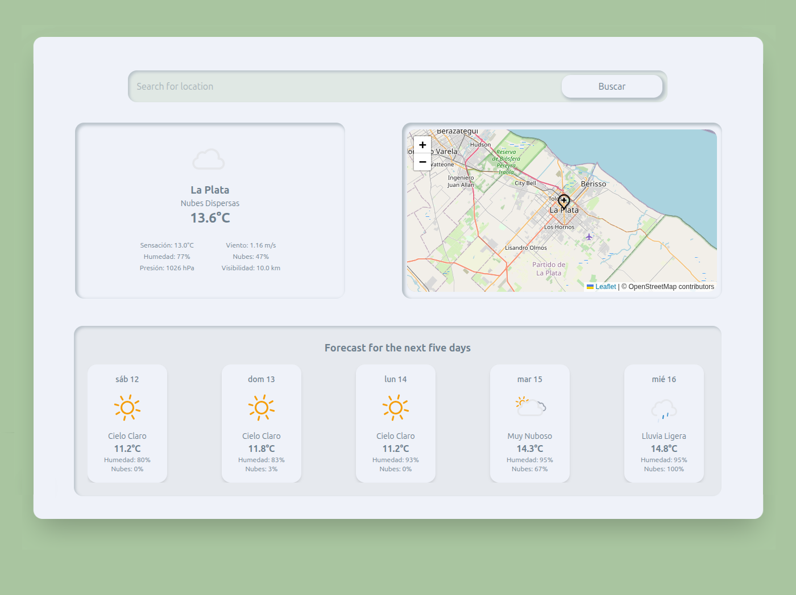

# 🌦️ Weather App

Aplicación del clima desarrollada con **Next.js**, **TypeScript**, **TailwindCSS** y consumo en tiempo real de la **OpenWeather API**. Incluye pronóstico extendido, ubicación en mapa y fondo dinámico día/noche.

---

## 🚀 Tecnologías utilizadas

- [Next.js](https://nextjs.org/) – Framework React con routing, SSR y optimización.
- [React](https://reactjs.org/) – Librería base para componentes UI.
- [TypeScript](https://www.typescriptlang.org/) – Tipado estático robusto.
- [Tailwind CSS](https://tailwindcss.com/) – Utilidades CSS modernas y flexibles.
- [OpenWeatherMap API](https://openweathermap.org/api) – Datos del clima actual y pronóstico.
- [Leaflet](https://leafletjs.com/) + [React Leaflet](https://react-leaflet.js.org/) – Mapa interactivo con marcador.
- Íconos animados SVG personalizados – Visualización moderna del estado climático.

---

## 📸 Vista previa



---

## 📦 Funcionalidades

- 🔍 Buscar clima por ciudad (incluso nombres compuestos).
- 📍 Visualizar ubicación en un mapa con coordenadas reales.
- 🌡 Clima actual:
  - Temperatura, humedad, descripción y sensación térmica.
  - Íconos animados personalizados.
- 📅 Pronóstico de 5 días (a las 12:00 hs cada día).
- 🌓 Cambio de fondo automático según la hora (día o noche).
- 🎨 Interfaz moderna y 100% responsive.

---

## 🛠️ Instalación

1. Cloná el repositorio:

```bash
git clone https://github.com/Nicolas-Eliazer-Jara/Weather.git
cd weather

## 📁 Estructura del proyecto

├── app
│   ├── component
│   │   ├── ForecastCard.tsx
│   │   ├── SearchBar.tsx
│   │   ├── WeatherCard.tsx
│   │   └── WeatherMap.tsx
│   ├── favicon.ico
│   ├── globals.css
│   ├── layout.tsx
│   ├── page.tsx
│   ├── services
│   │   └── weatherService.ts
│   └── types
│       └── weather.d.ts
├── .env.local
├── public
│   ├── fondo.png
│   ├── icons

## 🙌 Autor

Hecho con 💻 por Nicolás Eliazer Jara – 2025